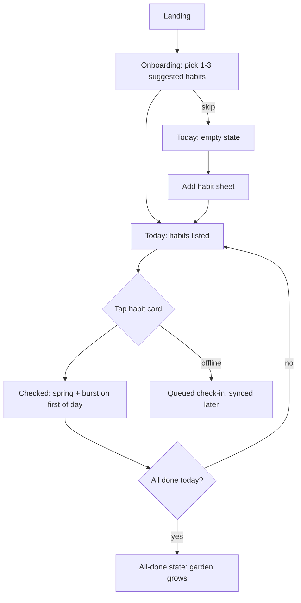

# UI/UX Plan: Ritma (Habit Tracker for Students)

> **Example output.** This is a fictional plan showing what UI/UX Compass produces for a new project. The developer asked for the plan in English; the product itself is Hebrew-first (RTL).

> **Status:** Draft  ·  **Version:** 0.2  ·  **Mode:** New project
> **Plan language:** English  ·  **Visual previews:** Yes (`docs/ui-ux-previews.html`)

## 1. Summary
Ritma is a mobile-first web app (PWA) that helps university students build study and wellbeing habits with low-pressure daily check-ins. The direction is **Soft 3D + Card-Based UI + Micro-Interaction Design** with a Calm UI tone: friendly and encouraging, never guilt-inducing. Hebrew-first with English as a second language. Scope: 9 screens and overlays, delivered in 5 milestones.

## 2. Vision & Users
- **Product purpose:** Check in on 3–7 daily habits in under 20 seconds, and see gentle progress over the semester.
- **Primary users:** Students aged 19–30, on their phones, between classes; mixed tech-savviness; often stressed during exam periods.
- **Desired feel:** encouraging, light, calm, playful-but-not-childish. **Not:** gamified pressure, guilt, corporate.
- **Success looks like:** first habit created in < 60s from landing; 7-day retention; check-in in < 20s.

## 3. Current State
N/A: new project.

## 4. Design Direction
- **Chosen direction:** Soft 3D (illustrations and icons) + Card-Based UI (habits as cards) + Micro-Interaction Design (satisfying check-ins), with Calm UI rules for tone and pacing.
- **Why it fits:** Soft 3D gives warmth and personality that works for students without feeling childish. Cards map directly onto habits. Micro-interactions make the core action (check-in) rewarding, which drives retention. Calm rules protect stressed users during exams.
- **Signature elements:** pastel soft-3D habit icons; 20px-radius cards with soft shadows; a springy check-in animation with a small particle burst; a weekly "garden" that grows instead of streak counters; Rubik for Hebrew and Latin.
- **Alternatives considered:**
  - *Neo-Brutalism + Bento*: energetic and distinctive, but too loud for daily use by stressed users.
  - *Japandi Digital*: very calm, but lower contrast palettes and less playful; weaker motivation loop.
- **Risks & mitigations:** pastel contrast → dark text on all pastel surfaces, checked at 4.5:1. Animation fatigue → celebrations only on the first check-in of the day and on milestones; reduced motion replaces them with a fade.

## 5. Stack & Tooling
- Next.js (App Router) + Tailwind v4 + shadcn/ui (Radix) + Motion + Lucide + next-intl + next-pwa
- **New dependencies:** Motion (spring check-in animation, ~30KB), next-intl (he/en, RTL), canvas-confetti (particle burst, ~6KB, lazy-loaded)
- **Alternative:** SvelteKit + shadcn-svelte, if preferred.

## 6. Design Tokens
| Token | Light | Dark |
|---|---|---|
| `color-bg` | `#FBF8F4` | `#121016` |
| `color-surface` | `#FFFFFF` | `#1C1922` |
| `color-text` | `#1F1B24` | `#F2EEF6` |
| `color-text-muted` | `#5E5866` (6.4:1 on bg) | `#A9A2B3` (7.1:1) |
| `color-primary` | `#6C4CF1` | `#9B86FF` |
| `color-on-primary` | `#FFFFFF` (5.9:1) | `#121016` (7.4:1) |
| `color-success` | `#1F8A5B` | `#4CC38A` |
| Habit pastels (surfaces only) | mint `#DDF5EA`, peach `#FFE5D6`, sky `#DDEBFF`, lilac `#EDE3FF`, lemon `#FFF4C7` | 20% tints of the same hues |

- **Type:** Rubik (Hebrew + Latin), scale 1.25: 14 / 16 / 20 / 25 / 31 / 39; body line-height 1.6; no letter-spacing.
- **Spacing:** 4px scale. **Radii:** sm 8, md 14, lg 20, full. **Shadows:** soft, two layers, low opacity.
- **Motion:** fast 150ms, normal 250ms, spring (stiffness 400, damping 25) for check-ins; reduced motion → opacity only.
- **Format:** CSS variables in `app/globals.css` under `@theme`, with a dark override on `[data-theme="dark"]`.

## 7. Screens & Flows
### 7.1 Screen inventory
| # | Screen / overlay | Purpose | Priority | Milestone |
|---|---|---|---|---|
| 1 | Welcome / onboarding (3 steps) | Value + pick first habits | P0 | 3 |
| 2 | Today | Daily check-in list | P0 | 3 |
| 3 | Add / edit habit (sheet) | Create habit: name, icon, days, reminder | P0 | 3 |
| 4 | Habit detail | History and weekly garden | P1 | 4 |
| 5 | Week overview | Progress across habits | P1 | 4 |
| 6 | Settings | Language, theme, reminders, data export | P1 | 4 |
| 7 | Delete habit (confirm dialog) | Destructive confirmation | P0 | 3 |
| 8 | Offline banner | Offline check-ins queued | P1 | 4 |
| 9 | 404 / error page | Recovery | P2 | 5 |

### 7.2 User flows

## 8. Screen Specifications
### 8.2 Today
- **Purpose & primary action:** check in on today's habits.
- **Layout:** mobile: greeting + date, progress ring, vertical list of habit cards, floating add button (inline-end bottom). Desktop: centered 560px column with a week summary on the side.
- **Key components:** HabitCard (icon, name, schedule chip, check control), ProgressRing, AddButton.
- **States:**
  | State | Design | Copy (he) |
  |---|---|---|
  | Default | Cards sorted: unchecked first | "בוקר טוב, נועה" |
  | Loading | 3 skeleton cards with the same height as real ones | none |
  | Empty: first use | Soft-3D seedling illustration + CTA | "עוד אין כאן הרגלים. בואו נשתול את הראשון 🌱" / [הוספת הרגל] |
  | Empty: nothing scheduled today | Calm illustration, link to week view | "אין הרגלים מתוכננים להיום. יום חופשי!" |
  | All done | Garden grows, gentle confetti (once per day) | "סיימת להיום. כל הכבוד!" |
  | Error loading | Keep cached list, inline banner + retry | "לא הצלחנו לרענן. [ניסיון נוסף]" |
  | Offline | Banner; check-ins show a small "pending" dot | "אין חיבור. נשמור ונסנכרן כשהחיבור יחזור." |
- **Interactions & motion:** check: scale 0.96 on press, spring to checked, icon pops; undo toast for 6s. Reduced motion: cross-fade only.
- **Notes:** habit names up to 40 chars, line-clamp 2; mixed Hebrew/English names wrapped in `<bdi>`.

*(Other screens follow the same format.)*

## 9. Global Patterns
- **Navigation:** bottom tab bar on mobile (Today, Week, Settings), sidebar on desktop; RTL order right-to-left.
- **Forms:** add-habit sheet, validate on submit, inline errors.
- **Feedback:** toasts at the bottom, 6s, with Undo for check and delete.
- **Confirmation:** delete habit shows a dialog with the habit's name and "history will be deleted".
- **Motion:** as tokens; celebrations max once per day.

## 10. UX Copy
**Voice:** warm, short, encouraging; plural-neutral Hebrew using infinitives for actions ("להוסיף", "לשמור") and a first name in greetings. No guilt: missed days are never highlighted in red.

## 11. Accessibility
WCAG 2.2 AA. Check controls are real checkboxes (`role="checkbox"` via Radix) with 44px targets; progress ring has a text equivalent; all pastel surfaces use dark text; celebrations are `aria-hidden` with an `aria-live` "הושלם" announcement.

## 12. Internationalization & RTL
Hebrew default (`dir="rtl"`), English secondary. Logical Tailwind utilities only (`ms-`, `pe-`, `start-`). Mirrored: back arrows, tab order, swipe-to-undo direction. Not mirrored: progress ring direction (clockwise), numbers. Dates via `Intl` with week starting on Sunday. ICU plurals for "{count} הרגלים".

## 13. Performance Budget
LCP ≤ 2.0s on 4G; soft-3D icons as 96px WebP sprites (< 60KB total); confetti lazy-loaded; Rubik variable font subset to Hebrew + Latin.

## 14. Milestones
| # | Milestone | Includes | Done when |
|---|---|---|---|
| 1 | Foundations | tokens, fonts, theme toggle, RTL setup, layout shell | both themes and both directions render |
| 2 | Core components | HabitCard, ProgressRing, Sheet, Toast, Dialog, all states | component states page passes the checklist |
| 3 | P0 screens | Onboarding, Today, Add habit, Delete | flows work end-to-end with mock data |
| 4 | P1 screens | Detail, Week, Settings, Offline | states tables implemented |
| 5 | Polish & QA | motion, 404, a11y pass, screenshots | QA report clean |
**Checkpoint preference:** report after each milestone and continue.

## 15. Verification Plan
`capture_screens.py` on each milestone: mobile/tablet/desktop × light/dark, plus `--rtl` for English pages; axe scan; keyboard pass on the check-in and add-habit flows.

## 16. Assumptions
| # | Assumption | Why | Impact if wrong |
|---|---|---|---|
| 1 | PWA, not native | Fastest path; mobile web is enough for check-ins | Native would change stack and navigation |
| 2 | No social features in v1 | Not mentioned; keeps the calm tone | Would add profile and feed screens |
| 3 | Local-first storage with sync later | Simplifies offline | Needs a backend decision |

## 17. Open Questions
- Push reminders in v1? (Default: in-app reminders only; web push in v2.)

## 18. Changelog
| Version | Date | Change |
|---|---|---|
| 0.1 | 2026-09-30 | Initial draft |
| 0.2 | 2026-09-30 | Replaced streak counter with the "garden" per feedback (less guilt) |

---
**Approval:** reply "approved" (or approve specific milestones) to start implementation.
